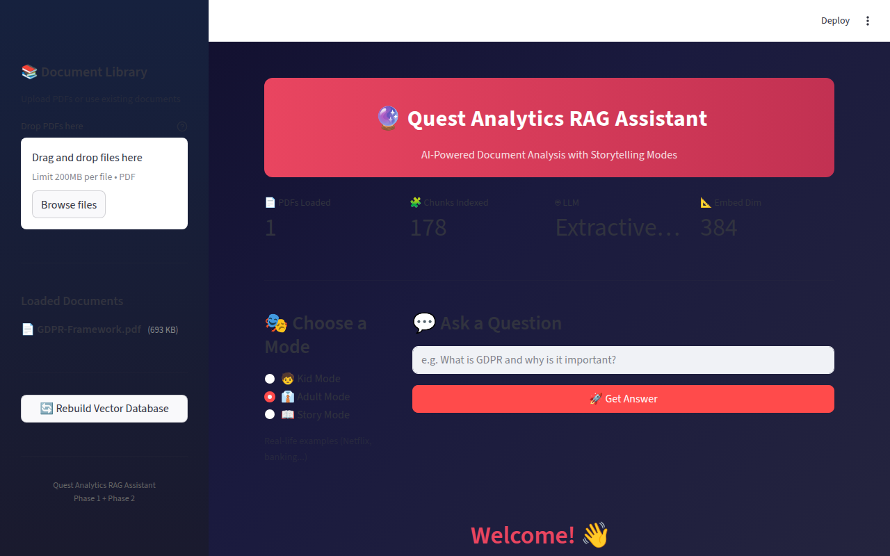
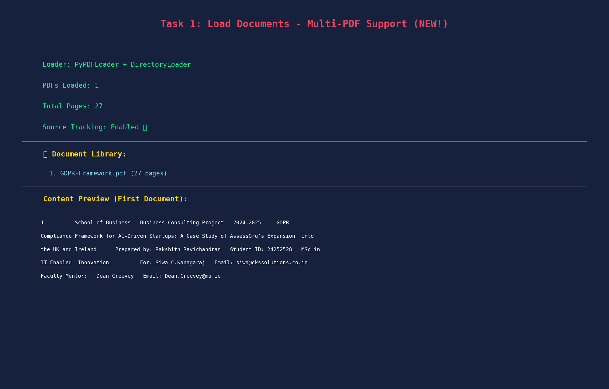
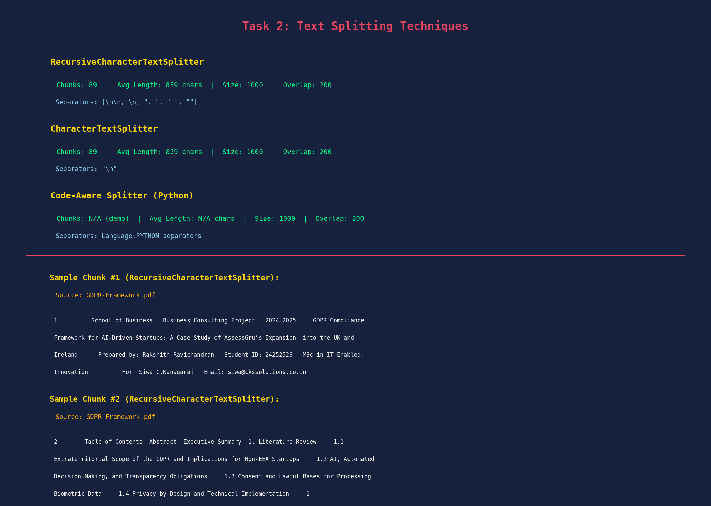
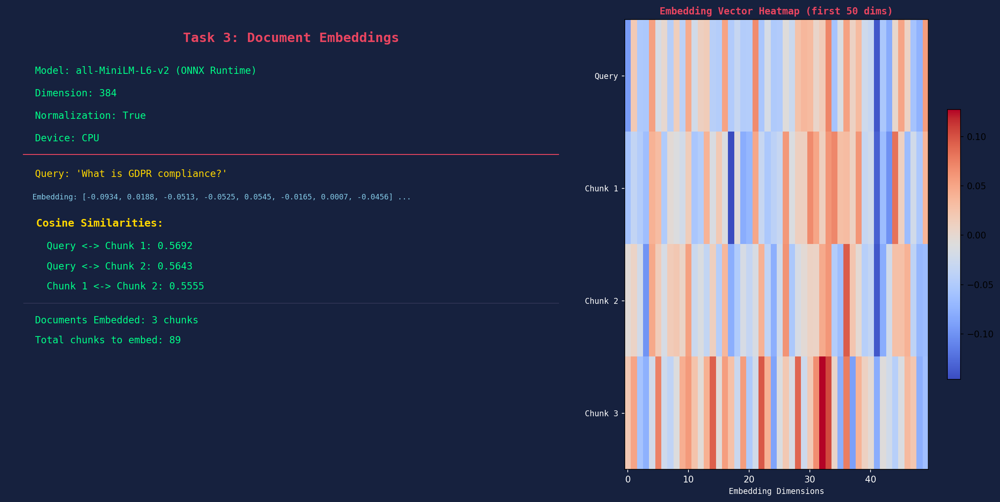
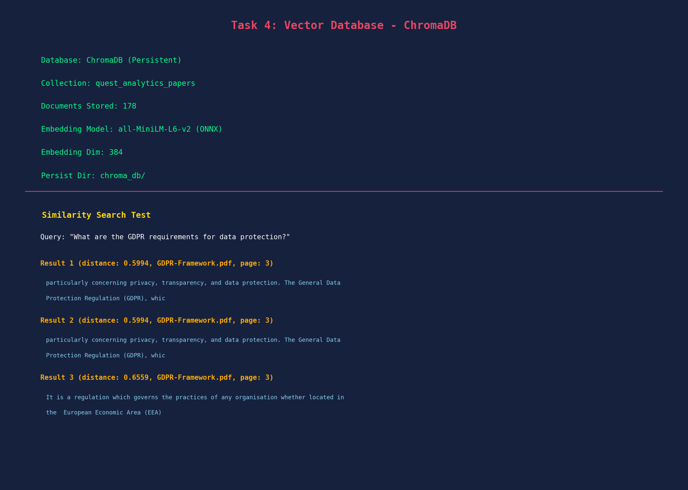
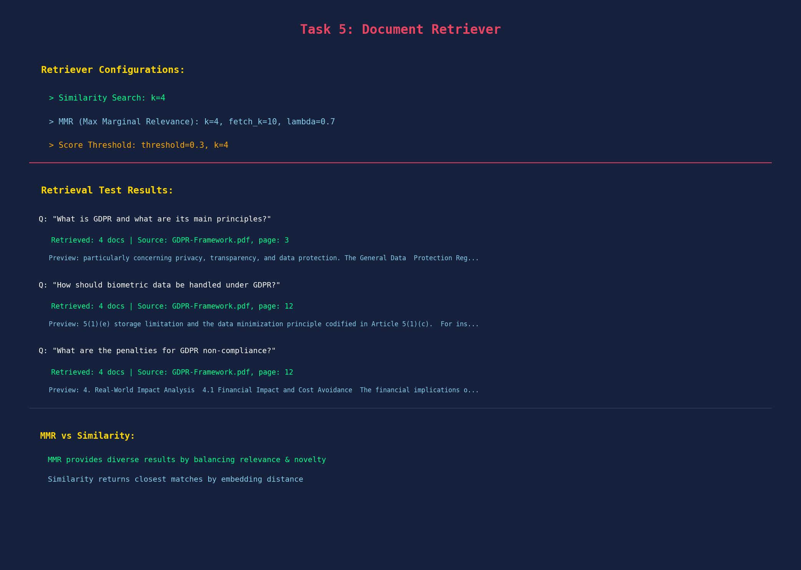
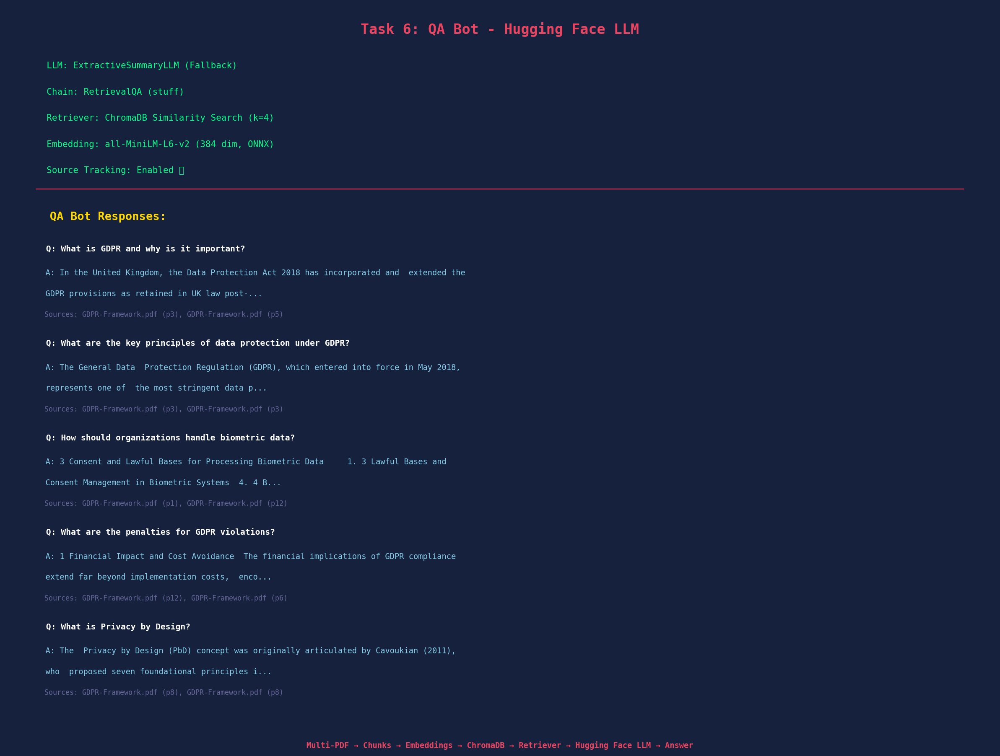
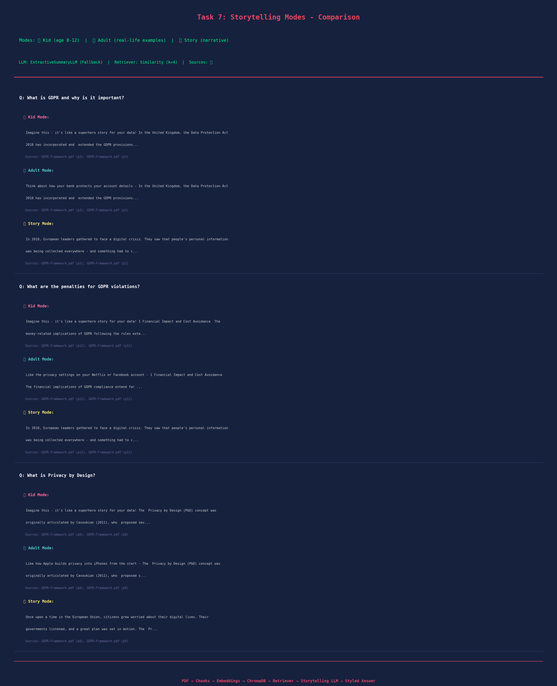

# Quest Analytics RAG Assistant

AI-Powered Document Analysis with Storytelling Modes — built with LangChain, ChromaDB, and Streamlit.

## Live Streamlit App



The web interface features a dark-themed UI with PDF upload, three storytelling modes (Kid, Adult, Story), and real-time document Q&A with source attribution.

---

## RAG Pipeline Screenshots

### Task 1: Load Documents — Multi-PDF Support



Loads PDFs using PyPDFLoader with source tracking enabled. Supports multiple documents from the `pdfs/` directory.

---

### Task 2: Text Splitting Techniques



Splits documents into 89 chunks (1000 chars each, 200 overlap) using RecursiveCharacterTextSplitter with smart separators.

---

### Task 3: Document Embeddings



Generates 384-dimensional embeddings using all-MiniLM-L6-v2 (ONNX Runtime). The heatmap shows embedding vector patterns across query and document chunks.

---

### Task 4: Vector Database — ChromaDB



Stores 178 document chunks in a persistent ChromaDB collection. Similarity search returns ranked results with distance scores and source page numbers.

---

### Task 5: Document Retriever



Supports three retrieval strategies: Similarity Search (k=4), MMR (Max Marginal Relevance), and Score Threshold filtering. Results include source file and page references.

---

### Task 6: QA Bot — Hugging Face LLM



Answers questions using a RetrievalQA chain with source attribution. Uses FLAN-T5 via Hugging Face API with an extractive fallback LLM.

---

### Task 7: Storytelling Modes — Comparison



Three explanation styles for every answer:
- **Kid Mode** — Simple words, fun analogies, superhero references (ages 8-12)
- **Adult Mode** — Real-life examples (Netflix, banking, iPhone privacy)
- **Story Mode** — Narrative format with historical context and characters

---

## Quick Start

### Prerequisites

- Python 3.8+
- pip

### 1. Clone the repository

```bash
git clone https://github.com/rravi219/RAG-assistant.git
cd RAG-assistant
```

### 2. Install dependencies

```bash
pip install -r requirements.txt
```

On some systems you may need:

```bash
pip install -r requirements.txt --break-system-packages
```

### 3. Set up environment variables

The `.env` file should contain:

```
HUGGINGFACE_API_KEY=your_huggingface_api_key_here
HF_MODEL_NAME=google/flan-t5-base
```

### 4. Run the Streamlit web app

```bash
streamlit run app.py
```

This opens the web UI at **http://localhost:8501** in your default browser.

### 5. Run the CLI pipeline (optional)

To generate screenshots and run all 7 tasks from the terminal:

```bash
python quest_analytics_rag.py
```

---

## Project Structure

```
RAG-assistant/
├── app.py                    # Streamlit web interface
├── quest_analytics_rag.py    # CLI pipeline (generates screenshots)
├── requirements.txt          # Python dependencies
├── .env                      # API keys (keep secret)
├── GDPR-Framework.pdf        # Sample research document
├── pdfs/                     # Additional PDF documents
├── screenshots/              # Generated pipeline visualizations
│   ├── pdf_loader.png
│   ├── code_splitter.png
│   ├── embedding.png
│   ├── vectordb.png
│   ├── retriever.png
│   ├── qabot.png
│   └── storytelling_comparison.png
└── chroma_db/                # Persistent vector database
```

---

## Troubleshooting

### Windows: `streamlit run app.py` does nothing or times out

1. Make sure all packages are installed — run `pip install -r requirements.txt` first
2. Check if another process is using port 8501:
   ```
   netstat -ano | findstr 8501
   ```
3. Try specifying the port explicitly:
   ```bash
   streamlit run app.py --server.port 8502
   ```
4. If the browser doesn't open automatically, manually navigate to `http://localhost:8501`
5. Run with Python directly to see any import errors:
   ```bash
   python -c "import streamlit; import langchain; import chromadb; print('All imports OK')"
   ```

### "ModuleNotFoundError"

Install the missing package:

```bash
pip install <package_name>
```

### "No PDF files found"

- Place PDF files in the `pdfs/` folder, or keep `GDPR-Framework.pdf` in the project root

### Hugging Face API timeout

- The app has a built-in fallback extractive LLM that works offline
- Check your internet connection if you want to use the Hugging Face API

---

## Tech Stack

| Component | Technology |
|-----------|-----------|
| Web UI | Streamlit |
| LLM | Hugging Face FLAN-T5 (+ extractive fallback) |
| Embeddings | all-MiniLM-L6-v2 (ONNX) |
| Vector DB | ChromaDB |
| Framework | LangChain |
| PDF Parsing | PyPDF |
